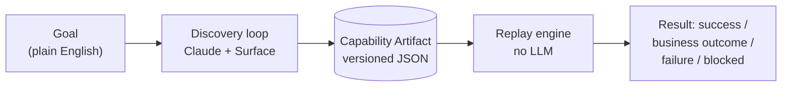
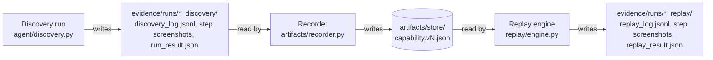

# Design Write-up

## 1. Architecture

The system is built around one idea. An LLM should only have to figure out a task once. After
that, a recorded "capability" should run the same task forever without paying for a model call
or inheriting a model's non-determinism. Everything here exists to serve that split.

There are six pieces, and each one only knows about the piece directly below it:

- **`mock_app/`** - This is the target app. Its's a small Flask app built to give a feel of a real legacy bank
  servicing tool which has nested HTML tables for layout, no test IDs, an embedded iframe and server-rendered
  pages. I built this instead of using a public sandbox because the main part of this
  problem was dealing with a UI that is messy and gives the automation nothing clean to grab onto, and a modern
  site may not have such messy UI.
- **`agent/surface.py`** - This is the only code that touches Playwright directly. It does two main functions:
  get_state() (an accessibility-tree snapshot plus a screenshot) and act() (click,
  type, select, extract, wait). Both the discovery loop and the replay engine will talk to a
  `Surface`, never directly to Playwright.
- **`agent/discovery.py`** - This runs the main LLM loop - observe -> ask Claude for one action -> execute it ->
  observe again. Every decision comes back through a single forced tool call (`act`), so I never
  parse free text out of the model — the model's answer *is* the typed `Action` object.
- **`artifacts/`** - This turns a successful discovery run into a saved, versioned JSON file (the
  capability). This conversion isn't fully automatic, a person decides which literal values
  become parameters and reviews the locators before they ship (more in Artifact schema).
- **`replay/engine.py`** - This executes a saved artifact with no LLM at all. So it resolves each step's
  locator and does it.
- **`agent/guardrails.py`** and **`escalation/handoff.py`** - These two sit across both loops. Every action,
  in discovery or replay, passes through a guardrail check before it touches the page, and a
  blocked or unrecoverable step can hand control to a human on the exact same live session.

Both `Discovery` and `Replay` talk to the page only through `Surface`, never Playwright directly.
Every action either of them takes is checked by guardrails first, and a blocked or unrecoverable
step is what triggers escalation, which gets its own section later. I left those two out of this
picture on purpose. They apply equally to both boxes above, and drawing them in made the diagram
harder to read instead of easier.

Here's the same idea again, but tracing the actual files on disk instead of the code that
touches them.

Nothing here is a database or a live service. Every arrow is just a plain file on disk. A
discovery run doesn't hand anything directly to the recorder. It just finishes writing its log
and screenshots into its own timestamped folder and exits. The recorder runs later, as a
separate step, and only ever reads that log file. It has no other connection to the discovery
loop that produced it. Same on the other side, replay doesn't know or care that a discovery run
or a recorder ever existed. It just loads whatever JSON happens to be sitting in
`artifacts/store/` and goes. That's deliberate. It means I can hand someone the `artifacts/`
folder on its own and they can run replay against it with nothing else in this repo.

A few decisions worth calling out, and why I made them.

- **I used plain scripts, not a service with a queue behind it.** At any moment, this system
  does exactly one thing. One browser, one task, one agent driving it. A queue or an async server
  exists to handle many things happening at the same time, and I don't have that problem, so
  building it would just be extra complexity for nothing. If this needed to run many tasks at
  once someday, that's the point where I'd add it, not before.
- **I read the page's accessibility tree instead of taking a screenshot and using vision.** There
  are two reasons. It's cheaper, since a page's accessibility snapshot is a small bit of text
  while a screenshot is a big image the model has to study every step. And it's more reliable for
  replay. "Click the button labeled Sign On" still works if the page shifts around a little,
  while "click at pixel (340, 512)" breaks the moment anything moves. Replay has to keep working
  for a long time, not just once, so I needed the option that actually holds up.
- **I made the model choose from one tool called `act`, not eight separate tools** (one for
  click, one for type, and so on). Every other part of this system expects the exact same shape
  of data no matter what the action is. If the model answered through eight different tool
  shapes, I'd have to convert each one back into that one shared shape anyway, so I just made the
  model answer in that shared shape directly. There's a real trade-off though. With eight
  separate tools, a badly-formed request, like a "click" with no target, gets rejected
  immediately by the API. With one tool, that mistake only gets caught a step later, in my own
  code. I accepted that because having one shared shape everywhere else mattered more to me than
  catching that one extra kind of mistake slightly earlier.

**A bug this caused, which only showed up after I switched models.** I'd assumed the model would
always answer with exactly one action per turn. That assumption turned out to be wrong. After I
switched from Claude Haiku to Claude Sonnet, Sonnet would sometimes answer with *two* actions in
a single turn, for example typing the username and the password together. My code only knew how
to handle one answer at a time, so the second one got left hanging, and the very next request to
the API failed because of it. At first this looked like a random glitch, since it only happened
sometimes. I turned on extra logging, watched it happen, and saw exactly what was going on. Two
actions were coming back in one response. Once I saw that, the fix was simple. Handle every
action the model sends in a turn, not just the first one, and tell the model plainly in its
instructions to send only one action per turn.

## 2. Artifact schema

The artifact file (`artifacts/schema.py`) is basically a recipe card for one task. It holds a
name and version, where to start (`target`), where it came from (`provenance`, meaning which run
made it, which model, and when), what inputs it needs (`input_params`), the list of steps to
follow (`steps`), what it hands back (`outputs`), how to check it actually worked (`checkpoint`),
and a list of expected non-error answers (`known_outcomes`). The idea is that anyone, a person or
another AI agent, can look at this one file and understand exactly what the task needs and what
it returns, without reading any code.

Each step points at an element using a `TargetLocator`. That means its role (button, textbox, and
so on) and its name (Sign On, Password, and so on), plus a `reasoning` field explaining why that
description should keep working over time. That field isn't just there for show.

**Here's the bug that made me add it.** The very first recording's step for reading the savings
balance was pointed at the balance itself, literally `$4231.00`. That's like writing down "the
answer is 7" instead of "add 3 and 4." It only works for that one case. I caught this while
building the recorder and added a second way to describe a target, `relative: "next_cell"`,
which means "find the cell labeled Savings Balance, then look at whatever's next to it." That
works no matter whose balance it is. I proved it by running the same recipe for a different
member and getting their correct, different number back.

Turning a raw run into a usable artifact isn't fully automatic. Two places are deliberately a
judgment call I make by hand, not something code decides.

- **Which typed values should become inputs.** The member ID typed during a run obviously should
  become something the caller fills in each time, but that's a decision about what the task is
  *for*, not something you can just guess from the log.
- **Fixing locators**, like the balance example above.

Both happen in `artifacts/recorder.py`. It reads the raw log from a run, and I decide how the
pieces map into a clean artifact.

**Credentials were another thing I had to catch and fix.** The first version of the artifact had
the fake sign-on username and password written directly into the file as plain text. Even though
they were fake, that's exactly the kind of thing you shouldn't do. A saved file shouldn't hold
credentials. So I changed it so the artifact never stores one at all. Whoever runs the task
supplies a fresh one each time, the same way they supply the member ID.

Each artifact in `artifacts/store/` carries a version number, currently 1 for both capabilities.
That field exists so a future re-recording, say after the target app's UI changes, or after
trying a different model, doesn't just silently overwrite what's already there. The old version
stays around as a known-good fallback while a new one gets reviewed, instead of the two quietly
swapping places underneath whoever's calling this capability.

## 3. Determinism & error handling

Replay never calls an AI model. It just reads the artifact, fills in the blanks with whatever
values were given, finds each element the way the artifact describes, does the action, and
checks at the end that everything worked. It stays reliable for two reasons. It finds elements
by role and name instead of by pixel position or a fragile bit of page code, and Playwright (the
browser tool underneath) already waits and retries on its own if the page hasn't finished
loading, so I didn't have to write that waiting logic myself.

When replay finishes, it always reports one of three outcomes. Getting this split right matters
a lot. Mixing up "this is a normal answer" with "this is a bug" is, per the assignment, the
easiest way to make a working system look broken.

- **`success`** means everything worked, here's the data.
- **`business_outcome`** means the task didn't succeed, but the reason is a normal, expected
  answer, not a bug. Things like "this member doesn't exist" or "this deposit isn't allowed."
  These are listed right in the artifact, so the system checks for them by name instead of
  guessing.
- **`failure`** means something went wrong that wasn't expected. This comes back with exactly
  which step failed, what should have happened, and what actually happened, not a confusing
  stack trace.

The assignment also asks about a third category, recoverable conditions, things like a stuck
dialog or a slow page, that aren't a normal answer and aren't a hard failure either. I don't have
a fourth status for this, on purpose. A recoverable condition isn't a different kind of outcome,
it's a different kind of resolution path that still ends in success or failure. A slow or
not-yet-rendered page is handled automatically, Playwright itself keeps retrying to find an
element for a bit before giving up, so I never had to write that logic by hand. Something more
serious, like a genuinely stuck step, gets escalated to a human and retried once control comes
back, which is covered in Escalation & handoff below. Either way, once it's resolved, the run just
carries on and reports success or failure like normal. Recoverable describes how a problem got
fixed along the way, not a new box in the result contract.

**Two real bugs came up while building this.**

1. Because this app's pages use nested tables for layout, a big outer cell's "name" can
   accidentally include a smaller cell's text inside it. So searching for "$4231.00" sometimes
   matched a huge chunk of the page instead of just the number. I fixed this by adding an option
   to require an exact match, not just "contains this text." This same problem showed up in
   three separate places while I was building things, which told me it's just how this kind of
   old-style page behaves, not a one-off accident.
2. My first version of replay had a bug where, if the target site was completely down, the whole
   program crashed with a confusing error instead of giving back a clean "here's what failed"
   answer. I found this by literally turning the mock app off in the middle of a test and
   watching it crash, then fixed it and tested again to confirm.

**One decision worth explaining clearly.** The sub-account form has a warning pop-up that shows
up if a member already has that type of account, and its "Continue Anyway" button actually
finishes creating the account right then. It's not a harmless warning, it does something
permanent. I thought about making the system automatically click past pop-ups like this on its
own, since the assignment specifically calls that out as good behavior to have. I decided not to,
on purpose. Clicking past this one automatically would mean the system quietly does something
permanent without asking anyone, which is exactly what the safety rules exist to prevent. So
instead I treat it as a normal expected answer, "this member already has this account type," and
let whoever's using the system decide what to do next.

## 4. Heterogeneity & multi-tenant

I only actually built and tested this against one target, the one mock bank app in this project.
But the design has a clear answer to both questions the assignment asks here, and it comes down
to one thing, `Surface`.

`Surface` has exactly two jobs. Look at the screen, and do one action. Nothing else in this
system, not the discovery loop, not the replay engine, knows or cares that Playwright even
exists. They only ever talk to `Surface`. So if I needed to support an old-style desktop app
instead of a website, I'd just build a different version of `Surface` for that, one that knows
how to read a desktop app's version of an accessibility tree (Windows and Mac both have their
own), and nothing else in the system would need to change. The artifact file itself doesn't
mention Playwright or browsers anywhere either. A step's target is just "a role and a name,"
which works the same whether it's a website or a desktop program.

Supporting many customers running the same software is a harder problem, but I'd solve it the
same way I solved the "recorded the answer instead of the question" bug from earlier. Don't
record something that only works for one case, record something that describes a stable
relationship. Two customers running the same underlying software usually have very similar
screens, even if colors or wording differ. So an artifact recorded for one customer should mostly
work for another, and where it doesn't, the `reasoning` field on that step is exactly where a
person, or eventually a carefully limited AI helper, would explain what needed to change. That's
a small patch on top of the same recording, not starting over. Noticing when a recording has gone
stale for a particular customer is what I'd build next. Since replay always reports success,
business outcome, or failure clearly, you could just watch for a task's success rate quietly
dropping for one customer, and that's a clear, measurable signal something needs a second look.

## 5. Escalation & handoff

There are exactly two situations where a real person needs to step in. A step is judged too
risky to do automatically, or something fails in a way the system doesn't know how to handle.
Both lead to the same place, `escalation/handoff.py`.

I wanted this handoff to actually work, not just look like it works on paper. So I built a small
typed command line. You can type things like `click button "some name"`, or `type`, or `select`,
plus a couple of helper commands, `state` to show the page and `resume` to say I'm done, give
control back. Whatever gets typed there runs through the exact same code discovery and replay
already use, on the exact same live browser window the automation had open. Nothing gets closed
and reopened. There's also a small file, `control_state.json`, that always says who currently has
control. The moment a handoff starts it flips to `"human"`, and the moment someone types `resume`
it flips back to `"automation"`. So at any point you can check that one file and know exactly
who's driving.

**I didn't just write this and hope it works, I tested it two ways.** `tests/test_handoff.py` is
an automated test with a scripted stand-in for a person typing commands, so it can run
unattended, one scenario where the "human" takes control right at the risky step and just types
`resume` without doing anything, correctly ending in failure since the account never got
created, and another where the "human" types the click command themselves before resuming,
correctly ending in success. But the strongest proof is `evidence/runs/
escalation_human_completes_confirmation/`, where I actually sat at the keyboard myself, watched
automation drive the real recorded steps, got dropped into a genuine `operator>` prompt when it
hit the guardrail-blocked step, typed the click command by hand, watched the browser window
actually do it, and typed `resume`. The account really got created, on the exact session
automation had already been using, with no scripting standing in for anyone. `handoff/
handoff_log.jsonl` records the real command I typed and that it succeeded; `control_state.json`
ends back on `"automation"`.

That evidence run's browser window is visible the entire time, not just during the handoff. That
isn't a requirement of the mechanism itself, the typed operator commands work identically
whether the browser is headed or headless, `test_handoff.py` proves that running fully headless.
It's visible there specifically so a person watching could see the handoff happen, and because
Playwright fixes headed-or-headless at the moment a browser launches, there's no way to make an
already-running session suddenly become visible only once escalation starts, and starting a
second, visible browser at that point would mean handing control of a different session, not the
real one automation had been using. A production version of this would run headless by default,
since most runs never need a human at all, and only expose the live session to someone through a
remote-viewing mechanism at the moment escalation actually triggers. That's meaningfully more
infrastructure than this project needs, and it's exactly the kind of thing the assignment scopes
out explicitly (a full co-browsing console). The typed command prompt is the deliberately minimal
stand-in for that, and it doesn't care whether anyone's watching the screen or not.

Replay and discovery behave a little differently once control comes back, on purpose.

- If **replay** was stopped by a safety rule, it just skips that one step once control returns.
  The person either did it themselves or chose not to, and either way replay shouldn't redo
  something a person just decided about.
- If **replay** hit an unexpected failure, an actual error rather than a safety rule, it tries
  that same step one more time after the handoff, on the idea that the person might have fixed
  whatever was wrong.
- **Discovery** just tells the model what happened and lets it keep going from there, the same
  way it reports any other action's result. I tested this specific part using a fake, scripted
  version of the AI model instead of a real one, so I could prove this piece works without
  spending real money on an API call that didn't need a real model to prove it.

One thing I didn't build is a proper visual control panel for the human to use. The assignment
says that's not required, and a working typed command line talking to the real browser session
is a more honest use of my time than a nice-looking screen that would do the exact same three
things underneath.

## 6. Safety

Every single action, whether it comes from the AI during discovery or from a saved recipe during
replay, gets checked by `agent/guardrails.py` before it's allowed to touch the real page. There's
no way around this, it happens every time, for both loops. It checks three things, all listed in
one settings file (`config/allowlist.yaml`).

- which websites and pages are even allowed to be visited
- which types of actions are allowed
- which specific buttons or actions are considered too risky to do automatically

Whether something is "risky" is decided by looking at the exact button, for example one whose
label says "Confirm and Open Account," not by the general type of action. That's because almost
everything the system does is technically just "a click," and the action type alone can't tell
the difference between clicking a search button and clicking a button that moves real money. If a
step is marked risky, it gets blocked completely, no exceptions, and that block is exactly what
brings a human in (see the section above). I tested this in a realistic way, not just in theory.
One test walks through seven completely real steps on the live app, signing in, filling out the
whole account form, reaching the review screen, and then gets correctly refused on the eighth
step, the actual button that would move money.

**Redaction** means keeping secrets like passwords out of anything that gets saved, logs and
artifact files both. It works by checking if a field's name matches a short list of sensitive
words (password, PIN, social security number, and so on), and if it matches, it swaps the value
for `[REDACTED]` before saving it anywhere. While building this, I actually caught a mistake I'd
made. My first list of sensitive words included "account number," which accidentally matched
this app's own "Member ID / Account Number" search box, a completely normal value that's supposed
to show up in the logs, not a secret. I found this because a test I wrote failed. I expected the
member ID to survive redaction, and it didn't. I fixed the list instead of just special-casing
that one field, since the same kind of accidental match could easily happen again somewhere else.

**Being honest about the limits here**, matching sensitive words by field name is a rough
approach. It can go wrong in both directions, flagging something that isn't actually secret, or
missing something that is if the field happens to be labeled unexpectedly. A better version would
check the actual type of the input box on the page, a real "password" field type, instead of
guessing from the label text, and that's the first thing I'd fix if I kept working on this.

I did go spend real API money proving the guardrail holds against a live model, not just against
the check function in isolation: I gave Claude a goal that explicitly told it to finish opening
the sub-account, "including confirming and finalizing the new account", instead of stopping
short like the recorded capability does. It walked through every real step, then tried to click
"Confirm and Open Account", got blocked, was handed back control after the human declined, tried
the identical click again on its own initiative, got blocked a second time, and only then gave up
with a clear `fail` explaining exactly why (`evidence/runs/20260911_102111_discovery/`). That run
also caught a real bug: the handoff log was overwriting itself on a second escalation within the
same run, so the first block's entry was silently lost the moment the second one happened. Fixed
in `escalation/handoff.py` (append instead of overwrite; per-step request filenames), and the run
was redone to confirm the fix, both escalations now show up distinctly.

## 7. Cuts

**A second version of `Surface`** for a desktop app or an old-style website with frames. I
designed the system so this would be possible, but I didn't actually build one. Building it
wouldn't have proven anything the design explanation above doesn't already cover, and the
assignment doesn't expect this to be built.

**Actually supporting many customers at once.** The assignment is clear that building this kind
of scaling infrastructure isn't what's being judged. The artifact file and its `reasoning` field
are shaped so a customer-specific fix would be a small patch, not a full rewrite, but I didn't
build the part that actually applies those patches.

**Automatically dismissing known pop-ups.** I seriously considered building this for the
duplicate-account warning pop-up, since the assignment specifically calls this kind of thing out
as worth handling. I decided against it on purpose. That pop-up's "continue" button finishes an
action that can't be undone, so having the system click past it automatically would mean quietly
bypassing the exact safety rule I built everything else around. I think this was the right call,
not a shortcut.

**A proper visual screen for the human handoff.** The typed command-line version is real, it runs
real actions on the real browser session, but it's not a nice-looking screen. Building one
wouldn't have changed whether the underlying handoff actually works, and the assignment says a
full visual console isn't required.

**One optional stretch goal, and only one.** I built the agent-facing capability interface
(`capabilities/interface.py`): every saved artifact turned into a tool definition shaped exactly
like an Anthropic API tool, and one `invoke(name, **kwargs)` function that runs it through the
same, unmodified replay engine every CLI replay command already uses. No new automation logic,
no new decision-maker, it just makes an existing capability callable the way the assignment's own
opening paragraph describes, "the AI agents can invoke it on demand", instead of only runnable
by a person typing a CLI command with a file path.

It's worth being precise about how many actual ways there are to trigger a replay now, because it
sounds like more than it is: there is one engine (`run_replay()`) and two doors into it, not
three. Door one is the original `replay.engine` CLI, by file path. Door two is
`capabilities.interface`, by name, `invoke(name, **kwargs)` internally, or as its own CLI
(`python -m capabilities.interface catalog` / `invoke <name> --param ...`). The "AI agent" piece
below isn't a third door; it's a different *caller* using door two, it doesn't touch `run_replay()`
itself at all, it hands its decision to the exact same `invoke()`. Deciding *which* capability
matches a goal is the calling agent's own job either way, the same way `agent/discovery.py`'s
model already picks between click/type/select from a tool description; this doesn't add a second
AI making decisions, it just makes what we already built callable by one.

Every demonstration of door two on its own still had a human picking the capability name and
typing the arguments, which isn't actually the scenario the assignment describes. So I built one
more, small, real proof: `scripts/demo_agent_calls_capability.py` hands a live Claude call the
exact catalog `build_catalog()` produces as its actual `tools=[...]` list, the same forced
tool-calling pattern `agent/discovery.py` already uses for individual clicks, just one level up,
and a plain-English request typed by a person, not the capability name or arguments. With two
real capabilities to choose between, it correctly picked `lookup-member-savings-balance` over
`open-sub-account` and correctly pulled the right arguments out of the sentence every time it was
tried, including with different member IDs and operator credentials than my own original example
(`evidence/runs/20260911_120853_agent_call/`). That's the one place in this entire stretch goal,
and the only script in the project, where real API money was spent specifically to prove an
agent, not a person, can use this interface.

I left the other five alone on purpose, not for lack of ideas. If I kept working on this, the
next one I'd add is a simple reliability score: since replay already reports success,
expected-answer, or failure every time it runs, I could just track how often each recipe succeeds
and stop it running unsupervised if that number drops too low. I'm already generating the data
this would need, so it wouldn't be much new work. After that, I'd look at letting the model help
fix a single failed replay step, and only one step, never open-ended, building on the same
human-handoff system that already exists.

**What I'd actually go fix first** is the redaction system. Matching field names against a list
of sensitive words already caught one real mistake, and I have no reason to believe it's the only
one. Checking the actual input type instead of guessing from the label is a much more solid
foundation than adding more words to a list that's fundamentally just guessing.
