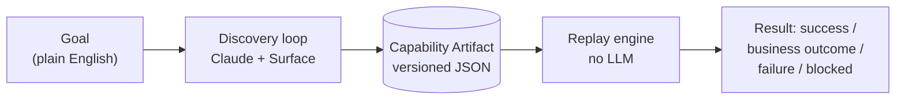
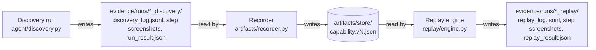
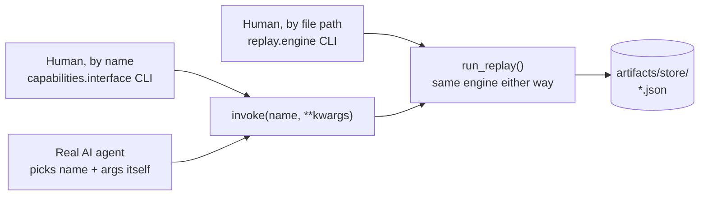

# Design Write-up

## 1. Architecture

The system is built around one idea. An LLM should only have to figure out a task once. After
that, a recorded "capability" should run the same task forever without paying for a model call
or inheriting a model's non-determinism. Everything here exists to serve that split.

There are six required pieces, each one only knowing about the piece directly below it, plus one
optional seventh:

- **`mock_app/`** - This is the target app. Its's a small Flask app built to give a feel of a real legacy bank
  servicing tool which has nested HTML tables for layout, no test IDs, an embedded iframe and server-rendered
  pages. I built this instead of using a public sandbox because the main part of this
  problem was dealing with a UI that is messy and gives the automation nothing clean to grab onto, and a modern
  site may not have such messy UI.
- **`agent/surface.py`** - This is the only code that touches Playwright directly. It does two main functions:
  get_state() (an accessibility-tree snapshot plus a screenshot) and act() (click,
  type, select, extract, wait). Both the discovery loop and the replay engine will talk to a
  `Surface`, never directly to Playwright.
- **`agent/discovery.py`** - This runs the main LLM loop - observe -> ask Claude for one action -> execute it ->
  observe again. Every decision comes back through a single forced tool call (`act`), so I never
  parse free text out of the model — the model's answer *is* the typed `Action` object.
- **`artifacts/`** - This turns a successful discovery run into a saved, versioned JSON file (the
  capability). This conversion isn't fully automatic, a person decides which literal values
  become parameters and reviews the locators before they ship (more in Artifact schema).
- **`replay/engine.py`** - This executes a saved artifact with no LLM at all. So it resolves each step's
  locator and does it.
- **`agent/guardrails.py`** and **`escalation/handoff.py`** - These two sit across both loops. Every action,
  in discovery or replay, passes through a guardrail check before it touches the page, and a
  blocked or unrecoverable step can hand control to a human on the exact same live session.
- **`capabilities/interface.py`** (optional stretch goal, not one of the six required pieces
  above) - Turns every saved artifact into a callable tool: a catalog other code or a real AI
  agent can discover, and `invoke(name, **kwargs)` to run one by name through the same
  `replay/engine.py` unchanged. More in the third diagram below and in Cuts.

Discovery and replay both talk to the page only through `Surface`, never Playwright directly, and
every action either takes is checked by guardrails first (left out of this picture on purpose,
they apply equally to both boxes and made the diagram harder to read, not easier).

Nothing here is a database or a live service, every arrow is a plain file on disk. Discovery
doesn't hand anything to the recorder directly; it finishes writing its log and exits. The
recorder runs later, as a separate step, and only reads that file. Replay doesn't know or care
whether a discovery run or a recorder ever existed either; it just loads whatever JSON is sitting
in `artifacts/store/`. That's deliberate: I can hand someone the `artifacts/` folder alone and
they can run replay with nothing else in this repo.

Once an artifact exists, there are two ways to run it, both ending at the same engine:

One engine, two doors, not three paths. `replay.engine`'s CLI takes a file path, unchanged since
Phase 5. `capabilities/interface.py` (the optional stretch goal, more in Cuts) takes a capability
name instead via `invoke()`, and is also a plain Python function other code can call directly,
not just a CLI. The "real AI agent" box isn't a third door, it's a different *caller* of the same
`invoke()` a human would otherwise type by hand, proven in
`scripts/demo_agent_calls_capability.py`.

A few decisions worth calling out, briefly:

- **Plain scripts, not a service with a queue.** One browser, one task, one agent at a time.
  Async or a queue solves a concurrency problem I don't have; I'd add it if this needed to run
  many tasks at once, not before. The real cost of skipping it now: if fifty of these had to run
  side by side tomorrow, this design falls over, there's no session isolation or scheduling built
  in, that would be new work, not a config flag.
- **Accessibility tree over screenshots.** Cheaper (text vs. an image every step), and more
  reliable for replay: "click the button labeled Sign On" survives minor page drift, "click at
  pixel (340, 512)" doesn't. The cost: anything that's only visible, not labeled, like a
  color-only warning with no accessible name, would be invisible to the agent's decision-making. I
  still take a screenshot every step, but only for a person reading the evidence afterward, not
  for the model to reason over.
- **One tool (`act`) with a `type` field, not eight separately named tools.** The model's answer
  and my internal `Action` object end up the same shape either way, so I made them identical from
  the start, no translation layer. Trade-off: a per-action tool schema would catch a malformed
  call (e.g. a click with no target) at the API level; mine catches it one step later, in my own
  code. I judged the shared vocabulary worth it.

That last choice caused a real bug, found only after switching models: `tool_choice` forces
*which* tool gets called, not *how many times* per turn. Claude Sonnet would sometimes answer
with two actions in one turn (e.g. typing the username and password together); my code only
handled the first, leaving the second's id unresolved, which the API then rejected on the next
request. Reproduced it with debug logging, fixed it by handling every tool call in a turn (not
just the first) and telling the model to send one action per turn.

## 2. Artifact schema

The artifact file (`artifacts/schema.py`) is a recipe card for one task: a name and version,
where to start (`target`), where it came from (`provenance`), typed `input_params`, the ordered
`steps`, typed `outputs`, a `checkpoint`, and expected non-error answers (`known_outcomes`).
Anyone, a person or another AI agent, should be able to read this one file and know exactly what
the task needs and returns, without reading code.

Each step targets an element by role and name, plus a `reasoning` field explaining why that
should keep working over time. That field isn't decorative: the first recording's balance-lookup
step was literally pointed at the value it had just read (`$4231.00`), the answer written down as
if it were the question, only matching that one member's page. Fixed by adding a `relative:
"next_cell"` locator mode (anchor on the stable label, take the adjacent cell), and proved it by
replaying against a different member and getting their real, different balance back.

Turning a discovery run into an artifact is deliberately manual in two places, both in
`artifacts/recorder.py`: deciding which literal values become `input_params` (a judgment call
about what the task is *for*, not inferable from the log), and locator overrides like the case
above. The recorder also caught the dummy sign-on credentials being saved as literal text in the
first version, exactly what the assignment's safety section warns against, so they're
parameterized the same way as the member ID now; the artifact never contains a credential.

I chose a human-reviewed step over a fully automatic conversion on purpose, an automatic version
would have to guess which values are "the task's data" versus "just how this run happened to go,"
and guessing wrong ships a broken or overly narrow capability. The real cost is speed: every new
capability needs a person to sit down with the log once, it doesn't scale to hundreds of
capabilities a day without that review step becoming the bottleneck.

Every artifact carries a version number (currently 1 for both capabilities), so a future
re-recording doesn't silently overwrite a known-good one, it sits alongside it until reviewed.

## 3. Determinism & error handling

Replay never calls an AI model: it reads the artifact, fills in the blanks, finds each element by
role and name (not pixel position or fragile page code), acts, and checks the result. Playwright
already waits and retries on its own if a page hasn't finished loading, so I didn't need to write
that logic by hand.

Every run ends in one of three outcomes, and keeping this split clean matters, conflating "normal
answer" with "bug" is, per the assignment, the easiest way to make a working system look broken:

- **`success`** - the checkpoint was met; here's the data.
- **`business_outcome`** - a normal, expected non-success answer ("no such member," "deposit not
  allowed"), declared in the artifact's `known_outcomes` so the engine never hardcodes per-app
  error strings.
- **`failure`** - something unexpected. Comes back with the step, what was expected, and what was
  observed, not a stack trace.

The assignment also names a third category, recoverable conditions. I don't have a fourth status
for it on purpose, it's a resolution *path*, not a new outcome type: a slow page is handled by
Playwright's own retry, a genuinely stuck step gets escalated to a human and retried once control
returns (Escalation & handoff below), and either way the run still ends in success or failure.

Two real bugs turned up building this. First, this app's nested tables mean an outer cell's name
can contain an inner cell's text as a substring, so a loose match on a value sometimes grabbed a
whole record instead of the one field, structural to this kind of page, since it showed up
independently in three different places. Fixed with an `exact`-match flag. Second, my first cut
of replay left the *initial* navigation outside the error handling, so a genuinely down target
crashed the whole program instead of returning a clean failure, found by stopping the mock app
mid-test.

One judgment call worth stating plainly: the sub-account flow has a duplicate-warning pop-up
whose "Continue Anyway" button actually finalizes the (irreversible) account, not a cosmetic
dialog. I considered auto-dismissing it, since the assignment names that as a recoverable-
condition example, and decided against it: that would mean replay quietly taking an irreversible
action on its own, exactly what guardrails exist to prevent. It's a `business_outcome` instead,
handed back to the caller to decide about.

## 4. Heterogeneity & multi-tenant

I only built and tested against one target, but the design has a specific answer here, and it's
the same seam both times: `Surface`. Its two methods (look at the screen, do one action) are the
entire contract discovery and replay depend on; neither knows Playwright exists. A desktop app
would need a different `Surface` underneath (Windows/macOS accessibility APIs instead of a
browser), and nothing above that line would change, the artifact schema doesn't mention Playwright
or a browser anywhere either.

Multi-tenant reuse is the harder problem, and I'd solve it the way I already solved locator
brittleness within one tenant: record a stable relationship, not a fixed path. Two tenants on the
same vendor product usually share the underlying structure even where branding differs; an
artifact should be tried as-is first, and where a locator fails, `reasoning` is exactly where a
person (or eventually a bounded, policy-checked LLM helper) would produce a per-tenant override,
a patch on a shared artifact, not a re-recording. I picked patching over re-recording because most
of a task usually still works, throwing the whole thing away and starting over wastes the parts
that didn't break. The cost is that patches pile up quietly: nobody notices when one artifact is
carrying five tenant-specific overrides until something breaks in a confusing way. Drift detection
is what I'd build next to catch that: replay's own three-way result over many runs is the natural
signal, a quietly dropping success rate on one tenant is a concrete, measurable trigger for review.

## 5. Escalation & handoff

Two situations need a person: a step is judged too risky to do automatically, or something fails
in a way the system doesn't know how to handle. Both lead to `escalation/handoff.py`.

I wanted this to actually work, not just look like it works on paper, so the "operator surface" is
a small typed command line (`click/type/select <role> <name> [value]`, plus `state`/`resume`) that
runs through the exact same `Surface.act()` code discovery and replay already use, on the exact
same live session, nothing torn down and recreated. A file, `control_state.json`, always says who
currently has control, flipping to `"human"` the moment a handoff starts and back to
`"automation"` on `resume`.

I tested this two ways. `tests/test_handoff.py` is automated, with a scripted stand-in for a
person, one scenario declining (correctly ends in failure) and one completing the risky step
(correctly ends in success). The stronger proof is `evidence/runs/
escalation_human_completes_confirmation/`, where I sat at the keyboard myself: automation drove
the real recorded steps, handed me a genuine `operator>` prompt at the guardrail-blocked step, I
typed the click command by hand, watched it happen, and typed `resume`. The account really got
created, on the exact session automation had already been using, no scripting involved.
`handoff_log.jsonl` records the real command and that it succeeded.

That run's browser is visible the whole time, which isn't a requirement of the mechanism itself
(the typed commands work identically headless, `test_handoff.py` proves that), just useful for a
person watching, and because Playwright fixes headed-or-headless at launch, there's no way to make
an already-running session visible only once escalation starts without handing over a *different*
session. A production version would run headless by default and expose the live session through a
remote-viewing mechanism only when escalation triggers, meaningfully more infrastructure than this
project needs, and exactly what the assignment scopes out (a full co-browsing console). The typed
prompt is the deliberately minimal stand-in for that.

Replay and discovery handle "after resume" differently, on purpose. If replay was blocked by
policy, it skips that step, the person already decided its fate. If replay hit a genuine
unexpected failure, it retries the same step once, on the idea the person's fix (clearing a stuck
dialog) should let it succeed now. Discovery just feeds the outcome back as a normal tool result
and lets the model keep reasoning, verified with a scripted fake model client so I didn't need a
live API call to prove wiring that doesn't depend on real model reasoning.

I didn't build a graphical control panel; the assignment doesn't require one, and a working typed
prompt on the real session is a more honest use of time than a screen doing the same three things
underneath.

## 6. Safety

Every action, from discovery or replay, is checked by `agent/guardrails.py` before it touches the
page, no path around it. It enforces three things from `config/allowlist.yaml`: which
sites/routes are allowed, which action types are allowed, and which specific targets are too
risky to do automatically.

Risk is classified by the exact target (role + name, e.g. the "Confirm and Open Account" button),
not by action type, since almost everything is technically just "a click." I chose this over
blocking by action type because blocking every click would make the system useless, and allowing
every click would make guardrails pointless, the danger is in *which* click, not the click itself.
The real cost of this choice: the allowlist has to already know about a risky element by name.
A new irreversible button nobody has configured yet would slip through as "just a click" until
someone adds it, this only protects against risks it's been told about. A risky target is
blocked outright, feeding directly into escalation. Proved this under real pressure, not just in
isolation: a test walks seven genuine steps on the live app and is correctly refused on the
eighth, the actual money-moving click. I also spent real API money proving this holds against a
live model, not just the check function: given a goal that explicitly says to finish opening the
account rather than stop short, Claude tried the blocked click, got refused, tried it again on its
own initiative, got refused a second time, then gave up with a clear explanation
(`evidence/runs/20260911_102111_discovery/`). That run caught a real bug too: the handoff log was
overwriting itself on a second escalation in the same run, silently losing the first block's
entry. Fixed to append instead of overwrite, and re-ran to confirm.

**Redaction** keeps secrets out of anything written to disk, matching field names against a short
sensitive-word list and swapping the value for `[REDACTED]`. Caught a real false positive while
building it: "account number" in that list matched this app's own "Member ID / Account Number"
search field, a legitimate value meant to be visible, not a secret. A failing test caught it; I
narrowed the list rather than special-case one field. Honest limit: matching by field label is
crude, with real risk in both directions. Keying off the actual HTML input type instead of the
label would be a better foundation, and it's the first thing I'd fix with more time.

## 7. Cuts

**A second `Surface` implementation** (desktop or legacy-frameset) - designed for, not built;
wouldn't prove anything the design discussion doesn't already cover, and isn't expected.

**Actual multi-tenant plumbing** - the assignment is explicit that scaling infrastructure isn't
being judged. The schema is shaped so a per-tenant fix is a small patch, not a rewrite, but I
didn't build the part that applies those patches.

**Automatically dismissing known pop-ups** - considered seriously for the duplicate-account
warning, decided against on purpose: that pop-up finishes an irreversible action, so auto-
dismissing it would mean quietly bypassing the same guardrail everything else is built around.

**A graphical operator console** - the typed version is real, genuine actions on the genuine live
session; a UI on top wouldn't change whether the control-transfer model works, and the assignment
scopes a full console out.

**One optional stretch goal, and only one: the agent-facing capability interface**
(`capabilities/interface.py`, see Architecture's third diagram for how it fits). Every saved
artifact becomes a tool definition shaped like a real Anthropic tool, and `invoke(name, **kwargs)`
runs it through the same, unmodified replay engine, no new automation logic, no new
decision-maker. Every demonstration of it on its own still had a human picking the name and
typing arguments, so I also built `scripts/demo_agent_calls_capability.py`: a live Claude call
gets the real catalog as its `tools=[...]` list and a plain-English request, and has to choose
between two real capabilities and fill in arguments itself. It picked correctly every time it was
tried, including with different member IDs and credentials than my own example
(`evidence/runs/20260911_120853_agent_call/`), the one place in this stretch goal real API money
was spent specifically to prove an agent, not a person, can use it.

I picked this one over the other optional stretch goals, like a reliability score or
LLM-assisted failure recovery, because it's the lowest-risk: it adds zero new decision-making and
zero new failure modes, it's just a new, machine-friendly way to call the exact same engine that
already runs. The honest trade-off is that it's also the least ambitious option: it doesn't make
the system smarter, more self-healing, or better at judging when to trust itself, which a
reliability score or LLM-assisted recovery would start to do.

I left the other five alone on purpose. If I kept going, next would be a simple reliability score
(replay already reports success/business-outcome/failure every run, so tracking a rolling success
rate per artifact and gating unattended use on it is mostly data I'm already producing), then
bounded, single-step LLM-assisted recovery on replay failure, building on the same escalation path
that already exists.

**What I'd actually go fix first**: redaction. One real false positive already found, no
confidence it's the last one; keying off the real input type is a better foundation than adding
more words to a list that's fundamentally guessing.
